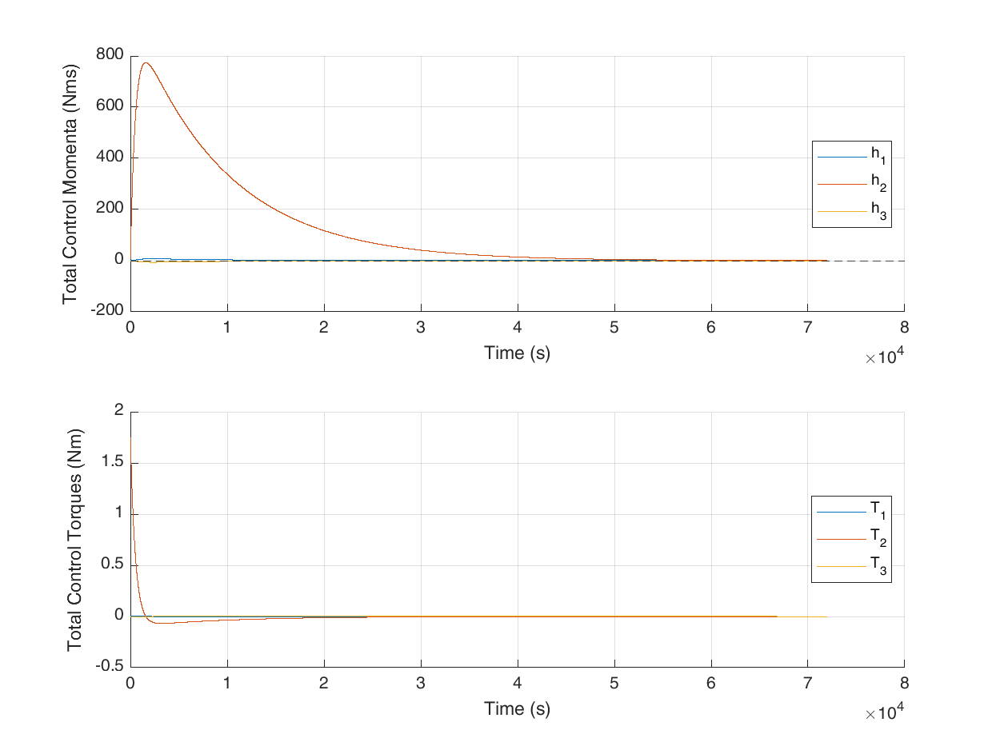

# ASPA Attitude Dynamics and Control System

<!-- ## Disturbance Torques -->
<!--  -->
<!--  -->
<!--  -->
<!--  -->
<!---->
<!-- ## Detumble -->
<!--  -->
<!--  -->
<!--  -->
<!--  -->
<!---->
<!-- ## Belly Flop -->
<!--  -->
<!--  -->
<!--  -->
<!--  -->
<!---->
<!-- ## Thruster Misalignment -->
<!--  -->
<!--  -->
<!--  -->
<!--  -->
<!---->
<!-- ## Roll -->
<!--  -->
<!--  -->
<!--  -->
<!--  -->
